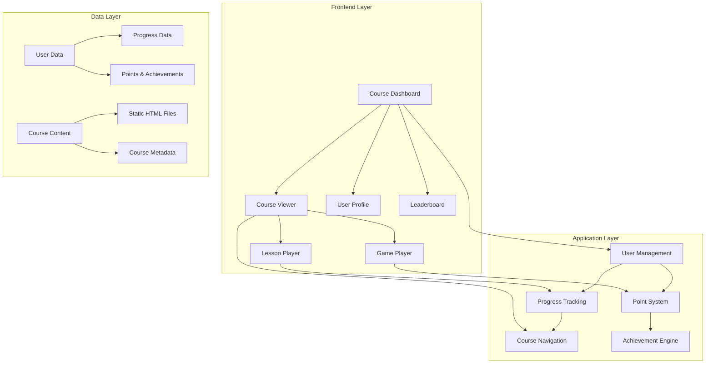

# Design Document

## Overview

EduQuest is a modern, gamified learning platform that transforms the existing collection of educational content into an interactive web application. The platform leverages the current folder structure (001-039) where each numbered folder represents a complete course module with lessons and interactive games. The design emphasizes user engagement through gamification elements, progress tracking, and a competitive leaderboard system.

The platform will maintain the existing content structure while adding a unified navigation layer, user management system, and gamification features. Each course retains its current lesson and game organization but gains enhanced tracking, point systems, and social features.

## Architecture

### System Architecture



### Technology Stack

- **Frontend**: Vanilla JavaScript, HTML5, CSS3 (maintaining compatibility with existing content)
- **Styling**: CSS Grid/Flexbox for responsive layouts, CSS custom properties for theming
- **Data Storage**: LocalStorage for user data persistence (with future database migration path)
- **Content Integration**: Iframe-based content loading (preserving existing HTML structure)
- **Build Process**: No build step required - direct browser compatibility

## Components and Interfaces

### 1. Main Dashboard Component

**Purpose**: Central hub for course selection and user overview

**Key Features**:
- Grid layout displaying all available courses (folders 001-039)
- Course progress indicators and completion status
- User stats summary (total points, completed courses, current streak)
- Quick access to leaderboard and profile

**Interface Structure**:
```html
<div class="dashboard">
  <header class="user-header">
    <div class="user-info">
      <span class="username">Usuario</span>
      <span class="total-points">1,250 puntos</span>
    </div>
    <nav class="main-nav">
      <a href="#leaderboard">Ranking</a>
      <a href="#profile">Mi Perfil</a>
    </nav>
  </header>
  
  <main class="course-grid">
    <div class="course-card" data-course="001">
      <div class="course-thumbnail"></div>
      <h3 class="course-title">Cómo Piensan los Ricos</h3>
      <div class="progress-bar">
        <div class="progress-fill" style="width: 65%"></div>
      </div>
      <span class="progress-text">13/20 completado</span>
    </div>
    <!-- Repeat for each course -->
  </main>
</div>
```

### 2. Course Viewer Component

**Purpose**: Enhanced version of existing course interface with gamification

**Key Features**:
- Maintains existing three-panel layout (lessons, content, games)
- Adds progress indicators and point notifications
- Implements content unlocking based on completion
- Integrates achievement notifications

**Enhanced Interface**:
```html
<div class="course-viewer">
  <header class="course-header">
    <div class="course-info">
      <h1 class="course-title">Cómo Piensan los Ricos</h1>
      <div class="course-progress">
        <span class="points-earned">+15 puntos ganados</span>
        <div class="progress-indicator">13/20 completado</div>
      </div>
    </div>
  </header>
  
  <div class="course-layout">
    <aside class="lessons-sidebar">
      <h3>Lecciones</h3>
      <ul class="lesson-list">
        <li class="lesson-item completed">
          <span class="lesson-icon">✓</span>
          <span class="lesson-title">Resumen Teórico</span>
          <span class="points">+10</span>
        </li>
        <li class="lesson-item current">
          <span class="lesson-icon">▶</span>
          <span class="lesson-title">Ejemplos Prácticos</span>
          <span class="points">10</span>
        </li>
        <li class="lesson-item locked">
          <span class="lesson-icon">🔒</span>
          <span class="lesson-title">Herramientas</span>
          <span class="points">10</span>
        </li>
      </ul>
    </aside>
    
    <main class="content-area">
      <iframe id="content-frame" src="001/lecciones/01_resumen_teorico.html"></iframe>
      <div class="content-controls">
        <button class="mark-complete">Marcar como Completado</button>
      </div>
    </main>
    
    <aside class="games-sidebar">
      <h3>Juegos y Actividades</h3>
      <ul class="game-list">
        <!-- Similar structure to lessons -->
      </ul>
    </aside>
  </div>
</div>
```

### 3. Progress Tracking System

**Purpose**: Monitor and record user learning progress

**Core Functions**:
- Track completion status for lessons and games
- Calculate progress percentages per course
- Maintain learning streaks and milestones
- Store completion timestamps

**Data Structure**:
```javascript
const userProgress = {
  userId: "user123",
  courses: {
    "001": {
      title: "Cómo Piensan los Ricos",
      lessonsCompleted: ["01_resumen_teorico", "02_ejemplos_practicos"],
      gamesCompleted: ["01_simulador", "06_flashcard"],
      totalLessons: 4,
      totalGames: 7,
      completionPercentage: 54,
      pointsEarned: 65,
      lastAccessed: "2024-11-04T10:30:00Z"
    }
  },
  totalPoints: 1250,
  coursesCompleted: 3,
  currentStreak: 7,
  achievements: ["first_course", "week_streak", "game_master"]
}
```

### 4. Point System Component

**Purpose**: Gamification engine for rewarding user engagement

**Point Values**:
- Lesson completion: 10 points
- Game completion: 15 points
- Course completion bonus: 50 points
- Daily login streak: 5 points per day
- First completion bonuses: 25 points

**Achievement System**:
```javascript
const achievements = {
  "first_course": {
    name: "Primer Graduado",
    description: "Completa tu primer curso",
    points: 25,
    icon: "🎓"
  },
  "week_streak": {
    name: "Semana Completa",
    description: "Mantén una racha de 7 días",
    points: 50,
    icon: "🔥"
  },
  "game_master": {
    name: "Maestro de Juegos",
    description: "Completa 25 juegos",
    points: 100,
    icon: "🎮"
  }
}
```

### 5. Leaderboard Component

**Purpose**: Social competition and motivation system

**Features**:
- Real-time ranking updates
- Multiple leaderboard categories (weekly, monthly, all-time)
- User position highlighting
- Achievement showcases

**Interface Structure**:
```html
<div class="leaderboard">
  <header class="leaderboard-header">
    <h2>Ranking de Aprendices</h2>
    <nav class="period-tabs">
      <button class="tab active">Esta Semana</button>
      <button class="tab">Este Mes</button>
      <button class="tab">Histórico</button>
    </nav>
  </header>
  
  <div class="user-position">
    <span class="position">#12</span>
    <span class="user-name">Tu posición</span>
    <span class="points">1,250 puntos</span>
  </div>
  
  <ol class="ranking-list">
    <li class="rank-item">
      <span class="position">1</span>
      <span class="username">Ana García</span>
      <span class="points">2,840</span>
      <div class="achievements">
        <span class="achievement">🎓</span>
        <span class="achievement">🔥</span>
      </div>
    </li>
    <!-- Repeat for top 10 -->
  </ol>
</div>
```

## Data Models

### User Model
```javascript
class User {
  constructor(username) {
    this.id = generateUserId();
    this.username = username;
    this.totalPoints = 0;
    this.coursesCompleted = 0;
    this.currentStreak = 0;
    this.lastLoginDate = null;
    this.achievements = [];
    this.createdAt = new Date().toISOString();
  }
}
```

### Course Model
```javascript
class Course {
  constructor(folderId, title, description) {
    this.id = folderId;
    this.title = title;
    this.description = description;
    this.lessons = [];
    this.games = [];
    this.totalPoints = 0;
    this.estimatedDuration = 0;
  }
  
  static fromFolder(folderId) {
    // Auto-discover lessons and games from folder structure
    const lessons = this.discoverLessons(folderId);
    const games = this.discoverGames(folderId);
    return new Course(folderId, this.extractTitle(folderId), "", lessons, games);
  }
}
```

### Progress Model
```javascript
class Progress {
  constructor(userId, courseId) {
    this.userId = userId;
    this.courseId = courseId;
    this.lessonsCompleted = new Set();
    this.gamesCompleted = new Set();
    this.pointsEarned = 0;
    this.completionPercentage = 0;
    this.startedAt = new Date().toISOString();
    this.lastAccessedAt = null;
    this.completedAt = null;
  }
  
  markLessonComplete(lessonId) {
    if (!this.lessonsCompleted.has(lessonId)) {
      this.lessonsCompleted.add(lessonId);
      this.pointsEarned += 10;
      this.updateCompletionPercentage();
    }
  }
  
  markGameComplete(gameId) {
    if (!this.gamesCompleted.has(gameId)) {
      this.gamesCompleted.add(gameId);
      this.pointsEarned += 15;
      this.updateCompletionPercentage();
    }
  }
}
```

## Error Handling

### Content Loading Errors
- Graceful fallback when course content fails to load
- Error messages with retry options
- Offline content caching for previously accessed materials

### Data Persistence Errors
- LocalStorage quota exceeded handling
- Data corruption recovery mechanisms
- Automatic backup and restore functionality

### User Experience Errors
- Network connectivity loss handling
- Browser compatibility warnings
- Mobile device optimization issues

## Testing Strategy

### Unit Testing
- Progress tracking calculations
- Point system accuracy
- Achievement trigger conditions
- Data model validation

### Integration Testing
- Course content loading and display
- User data persistence across sessions
- Leaderboard ranking calculations
- Cross-browser compatibility

### User Experience Testing
- Mobile responsiveness across devices
- Content accessibility compliance
- Performance with large course catalogs
- Gamification element effectiveness

### Content Integration Testing
- Existing HTML content compatibility
- CSS styling preservation
- JavaScript functionality maintenance
- Iframe security and performance

## Performance Considerations

### Loading Optimization
- Lazy loading for course thumbnails and content
- Progressive enhancement for slower connections
- Efficient caching strategies for static content

### Data Management
- Optimized LocalStorage usage patterns
- Periodic data cleanup and compression
- Efficient progress calculation algorithms

### Responsive Design
- Mobile-first approach maintaining existing layouts
- Touch-friendly interface elements
- Optimized content delivery for various screen sizes

## Security Considerations

### Data Protection
- Client-side data encryption for sensitive information
- Secure user session management
- Protection against XSS in user-generated content

### Content Security
- Iframe sandboxing for course content
- CSP headers for enhanced security
- Input validation for user data

## Migration and Deployment

### Content Preservation
- Zero-disruption integration with existing HTML files
- Backward compatibility with current course structure
- Gradual feature rollout capability

### User Onboarding
- Simple registration/login process
- Tutorial system for new users
- Import functionality for existing progress (if applicable)

### Scalability Planning
- Database migration path for future growth
- API design for potential backend integration
- Multi-language support preparation